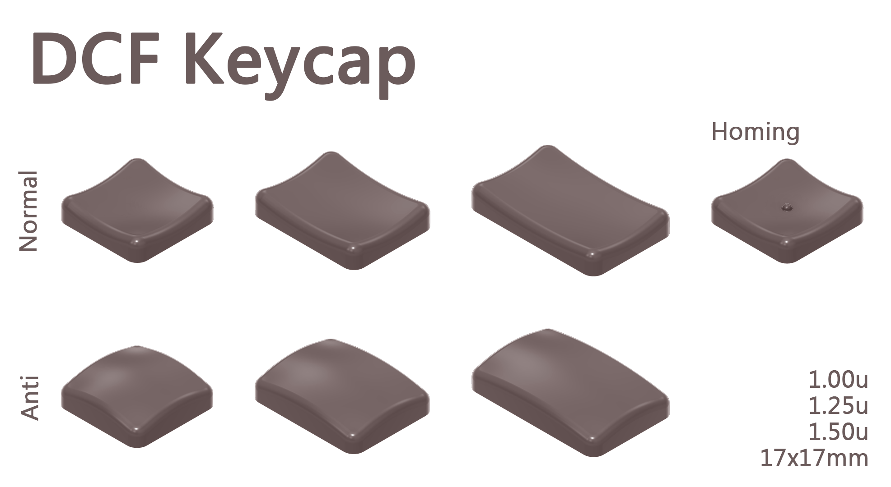
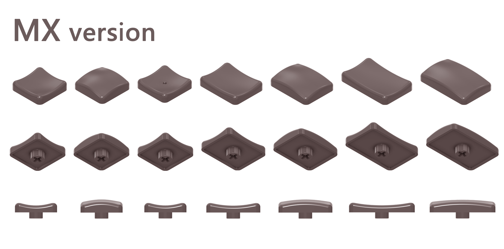
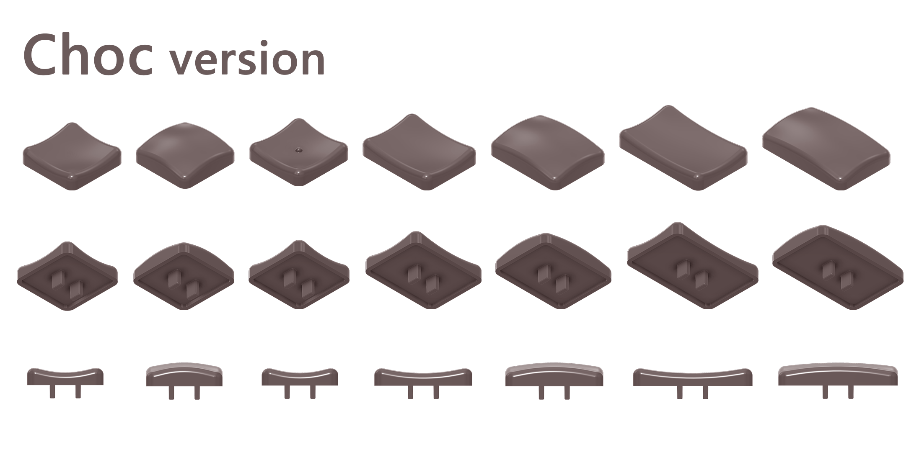
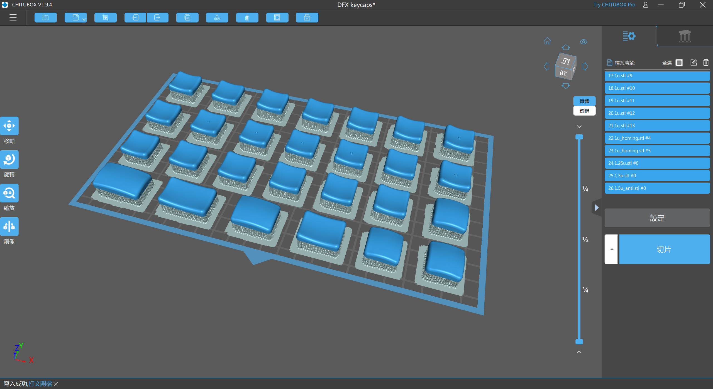
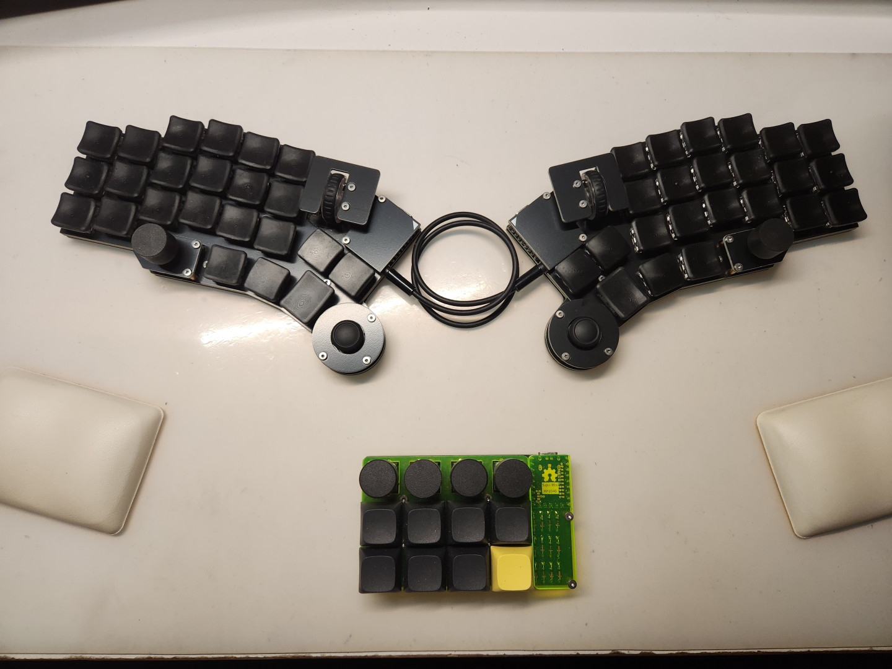
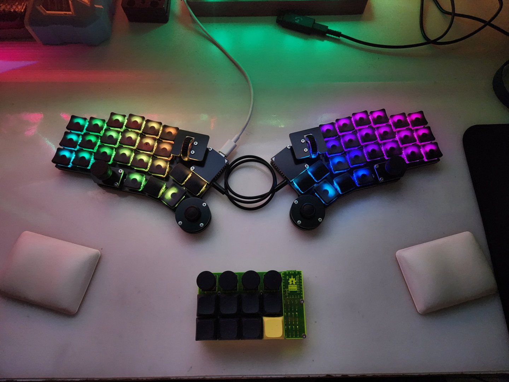

# DCF Keycaps

## 詳細說明

我在不久前設計並且組裝完成了Prime52 v1，於是就想說來設計一款專門給它使用的鍵帽，剛好我手邊有著白色的[CFX](https://chosfox.com/collections/keycaps)鍵帽，於是就根據它的外觀規格設計，做了這款長的很像CFX、規格卻大不同的鍵帽。

會取名叫做DCF，就是因為靈感來自CFX，取用Chosfox的CF作為鍵帽的名稱，是對CFX鍵帽的敬意。

## 數據規格

## 3D列印及成品

- 推薦使用SLA或LCD機型之3D列印機進行列印，效果最佳。

- 年輪效果推薦直接180度平貼載台加支撐效果最佳，照片中僅微調旋轉Y軸5度左右。

- 樹脂可做到的透光效果如下：

## 參考及使用工具

- AutoDesk Fusion.
- Frozen Mighty 8K + ONYX Pro410.
- CFX Keycaps.
